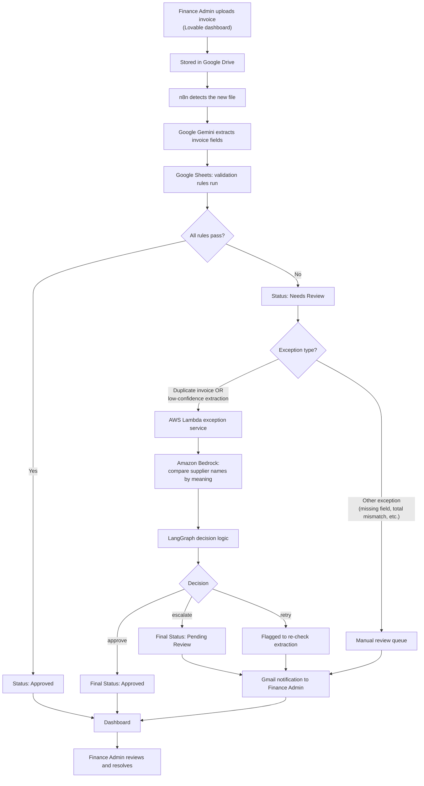

# Architecture Diagram

A visual view of the flow described in `architecture.md`. GitHub renders this automatically — no image file needed.

```mermaid
flowchart TD
    A["Finance Admin uploads invoice<br/>(Lovable dashboard)"] --> B["Stored in Google Drive"]
    B --> C["n8n detects the new file"]
    C --> D["Google Gemini extracts invoice fields"]
    D --> E["Google Sheets: validation rules run"]
    E --> F{"All rules pass?"}
    F -- Yes --> G["Status: Approved"]
    F -- No --> H["Status: Needs Review"]
    H --> I{"Exception type?"}
    I -- "Duplicate invoice OR<br/>low-confidence extraction" --> J["AWS Lambda exception service"]
    I -- "Other exception<br/>(missing field, total mismatch, etc.)" --> K["Manual review queue"]
    J --> L["Amazon Bedrock:<br/>compare supplier names by meaning"]
    L --> M["LangGraph decision logic"]
    M --> N{"Decision"}
    N -- approve --> O["Final Status: Approved"]
    N -- escalate --> P["Final Status: Pending Review"]
    N -- retry --> Q["Flagged to re-check extraction"]
    G --> R["Dashboard"]
    O --> R
    P --> S["Gmail notification to Finance Admin"]
    K --> S
    Q --> S
    S --> R
    R --> T["Finance Admin reviews and resolves"]
```
